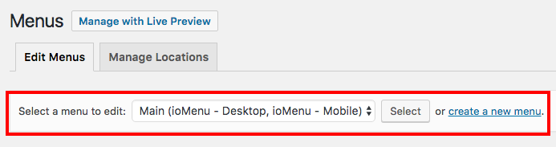
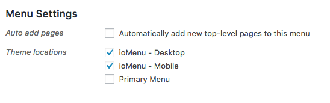

# Configuration

### Creating a Menu
* Go to Appearance > Menus
* *[If you want to use an existing menu]* Select a menu to edit from the dropdown and click "Select".
* *[If you want use a different a new menu]* Click on Create a new menu link. 
* Add menu items to your menu like you normally would.
* Scroll down to **Menu Settings** 
* If you want to use the same menu on both Mobile an Desktop, check *ioMenu - Desktop* and *ioMenu - Mobile*. Or you can choose only one of them and create another menu for the other Theme Location.
* Press Save Menu button

### Menu Configurations
#### Configuration and Styling Options
 The global options offered by ioMenu are in Customizer. To configure these options:
* Go to Appearance > Customize
* Click on the ioMenu Section in Customizer
* You can configure all the provided options.

#### Menu Items and Dropdown Options
Every Menu item has its own set of options for enabling Megamenu, styling, adding icon etc. To edit these:
* Go to Appearance > Menus
* Make sure you are editing the correct menu. 
* Click on any menu item to reveal its options.
* You should find new options for you to configure.