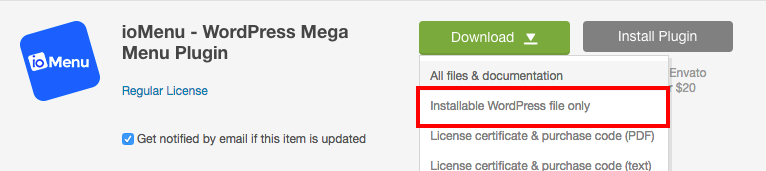

# Installation

### Download ioMenu
* Go to codecanyon.net > [Downloads](https://codecanyon.net/downloads)
* Find ioMenu in the list and click on the "Download" button.
* Select "Installable WordPress file only" from the list. 

### Install ioMenu
* Login to your Website's WordPress Dashboard.
* Go to *Plugins > Add New* and click on the "Upload Plugin" button. 
* Choose the file named *ioMenu.zip* and upload it. Remember, not *ioMenu-v1.x.zip* as you'd have to unzip that file to find *ioMenu.zip* inside it.
* Activate ioMenu. You should see ioMenu visible on your website at this point but the menu it shows might not be correct.
