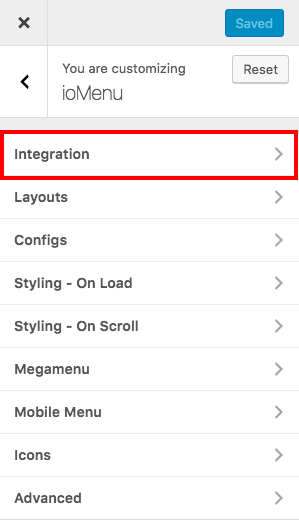
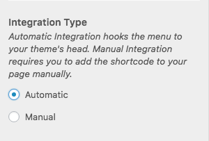
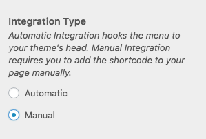

# Integration

> If your ioMenu came packed with your theme, it probably is already integrated with the theme.

Integrating ioMenu is a simple process. There are two main steps involved: 
 * Integrating ioMenu (Automatic/Manual)
 * Hiding theme's Menu.

### 1. Automatic Integration
 Automatic Integration is an integration option offered by ioMenu which is enabled by default. It hooks ioMenu to the header of the theme. Automatic integration displays ioMenu on your website without any additional configurations. However, it does not automatically hide your theme's menu. 

#### Requirements for Automatic Integration
 The only requirement for Automatic Integration is that your theme must correctly use WordPress's [wp_head()](https://developer.wordpress.org/reference/functions/wp_head/) function.

#### Enabling Automatic Integration
* Go to *Appearance > Customize*
* Once you're in Customizer, click on ioMenu and the Integration 
* In the **Integration Type** option, choose *Automatic* 
* Click Save & Publish

### 2. Manual Integration
 Manual Integration allows you to place the ioMenu shortcode or a PHP Code Snippet. You can use manual integration if you want to place the shortcode or PHP code via a Page Builder or manually edit your Child Theme's header.

#### Requirements for Manual Integration
 Manual Integration has no as such requirements.
 
 #### Enabling Manual Integration
 * Go to *Appearance > Customize*
* Once you're in Customizer, click on ioMenu and the Integration 
* In the **Integration Type** option, choose *Manual* 
* Click Save & Publish