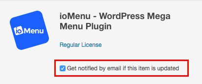

# Update

There are two ways of updating ioMenu. You can use the Automatic Update offered by ioMenu. Alternatively, you could manually uninstall ioMenu and install the updated version. **You don't loose your configurations on updating ioMenu.**

### Receive Update Notifications
 To receive an update when an ioMenu update is made available:
 * Go to codecanyon.net > [Downloads](https://codecanyon.net/downloads)
 * Find ioMenu from the list
 * Check the checkbox which says "*Get notified by email if this item is updated*" 

### Automatic Update
* Go to *Dashboard > Updates* 
* Click on Check Again button
* If an update was made available, you should see it in the list below.
* Choose ioMenu and click Update Plugin

### Manual Update
* Go to *Plugins > Installed Plugins*
* Deactivate and delete ioMenu
* Follow the [Installation Guide](../getting-started/installation.md) after ioMenu is deleted.